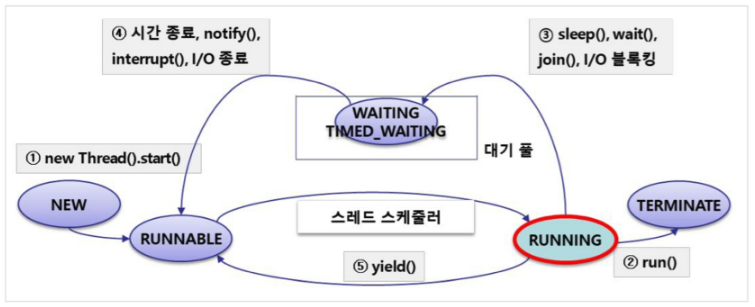

# JVM 쓰레드 스케줄링

JVM 내의 한 프로세스의 멀티쓰레드는 Concurrency하게 동작합니다. 여러 쓰레드를 동시성으로 멀티쓰레드를 동작시키기 때문에 쓰레드의 동작 상태에 대한 정의가 필요합니다. 각 쓰레드가 수행되고, 혹은 다른 쓰레드의 수행을 대기하는 여러 상태가 존재합니다.

# Thread의 상태

JVM은 쓰레드를 New, Runnable, Running, Wating, Terminate의 다섯가지 상태로 관리합니다. 쓰레드의 상태는 `getState()` 메서드 호출로 반환받을 수 있습니다.



### New

각 쓰레드 객체의 `start()` 메서드를 통해 동작시키게 되면 해당 쓰레드 객체는 JVM의 쓰레드 스케줄링 대상이 되며 **Runnable** 상태에 돌입하게 됩니다. **한 번 New 상태에 돌입한 쓰레드는 다시 New 상태가 될 수 없습니다.**

### Runnable

**New** 상태를 지나온 쓰레드는 **Runnable** 큐에 대기하게 되는데 JVM은 각 쓰레드의 우선순위에 따라서 **Running** 상태로 만들어 쓰레드를 동작시킵니다. 

### Running

쓰레드 스케줄러에 의해 Running 상태로 이동하게된 쓰레드는 재정의된 `run()` 메소드가 호출됩니다. `run()` 에 의해 실제 동작이 수행되며 `run()` 메소드가 종료되면 **Terminate** 상태가 됩니다. 이 때 I/O 호출, `sleep()`, `join()` 등의 인터럽트가 발생하게 되면 쓰레드는 **Waiting Pool** 로 이동하여 대기하게 됩니다. 또한 해당 쓰레드의 `run()` 메소드의 수행이 길어지거나 `yield()` 메서드가 수행되게되면 JVM은 해당 쓰레드를 다시 **Runnable** 상태로 옮깁니다.

### Waiting

쓰레드의 수행 중 I/O 블로킹이나 `sleep()`, `join()` 의 메서드에 의해 대기해야할 경우 쓰레드는 **Waiting Pool** 로 이동하게 됩니다. **Waiting Pool** 내의 쓰레드는 해당 I/O의 수행을 마치거나, `sleep()`, `join()` 등의 대기 조건이 끝나거나 혹은 **인터럽트가 발생되게 되면 다시 Runnable 큐로 이동합니다.**

### Terminate

**Running** 상태의 쓰레드가 `run()` 메소드의 수행이 끝나면 **Terminate** 상태가 되며 쓰레드가 종료됩니다. 한번 **Terminate** 된 쓰레드 객체는 다시 쓰레드 `start()` 메서드를 호출하여 스레드 스케쥴링에 포함시킬 수 없습니다.

# Thread 상태 제어 메서드

### start()

- `start()` 메서드를 수행하면 native 메서드인 `start0()` 를 통해 쓰레드를 스케쥴러의 **New** 상태에 포함시킬 수 있습니다.
- 스케쥴러에 포함된 쓰레드는 쓰레드 큐 내에서 runnable로 대기합니다.

```java
public synchronized void start() {
		// 해당 쓰레드는 시작되지 않은 상태여야 한다. 한번 수행된 쓰레드는 다시 수행할 수 없음.
    if (threadStatus != 0)
        throw new IllegalThreadStateException();

    group.add(this);

		// started 플래그를 통해 예외를 받는다.
    boolean started = false;
    try {
        start0();
        started = true;
    } finally {
        try {
            if (!started) {
                group.threadStartFailed(this);
            }
        } catch (Throwable ignore) {
            /* do nothing. If start0 threw a Throwable then
              it will be passed up the call stack */
        }
    }
}

private native void start0();
```

### run()

- `start()` 메서드를 실행하면 스케쥴러 내에서 실제 동작하는 부분입니다. `Thread` 클래스는 `Runnable` 인터페이스의 `run()` 메소드를 구현했습니다.
- `target.run()` 메서드를 수행하기 때문에 생성자를 통해 `target` 을 지정하거나 `Thread` 클래스를 상속해 `run()`  메서드를 재정의해야합니다.
- **쓰레드의 `start()` 메서드를 호출하지 않고 `run()` 메서드를 직접 호출하면 쓰레드는 스케쥴러에 포함되지 않고 일반 메서드를 호출한 것처럼 동작합니다. 그렇기 때문에 `run()` 메서드를 수행하는 쓰레드는 호출한 쓰레드가 됩니다.**

```java
//Thread 클래스의 run()
private Runnable target;
// 
@Override
public void run() {
    if (target != null) {
        target.run();
    }
}
```

### sleep()

- `sleep()` 메서드를 통해 쓰레드를 **Waiting pool** 로 보내 대기시킬 수 있습니다.
- **static 메서드이므로 호출한 쓰레드가 대기상태에 들어갑니다.**
- ms 단위의 시간을 매개변수로 받아 해당 시간만큼 쓰레드를 대기시킵니다.
- 인터럽트가 발생하면 다시 Runnable 상태가 되며 `InterruptedException` 을 발생시킵니다.

```java
public static native void sleep(long millis) throws InterruptedException;
```

### join()

- `join()` 을 호출하게되면 1/1000 초의 대기 시간을 매개로 받습니다.
- `join()` **을 호출한 쓰레드는 호출된 쓰레드**가 수행이 완전히 종료되고 매개로 받은 대기 시간만큼 대기한 후 다시 수행됩니다.
- 호출 시 **Wating Pool** 로 이동했다가 해당 쓰레드가 **Terminate** 되면 다시 **Runnable** 상태로 돌입합니다.

```java
public final synchronized void join(long millis)
throws InterruptedException {
    long base = System.currentTimeMillis();
    long now = 0;

    if (millis < 0) {
        throw new IllegalArgumentException("timeout value is negative");
    }

    if (millis == 0) {
        while (isAlive()) {
            wait(0);
        }
    } else {
        while (isAlive()) {
            long delay = millis - now;
            if (delay <= 0) {
                break;
            }
            wait(delay);
            now = System.currentTimeMillis() - base;
        }
    }
}
```

### yield()

- 동시성 동작에서 현재 **Running** 인 쓰레드가 **Running** 상태를 양보하는 메서드입니다.
- `yield()` 메서드를 호출한 쓰레드는 **Running** 상태를 해제하고 **Runnable** 큐로 이동합니다.

```java
public static native void yield();
```

### Interrupt()

- IO 호출, `sleep()`, `join()` 등에 의해 **Waiting Pool** 로 이동한 쓰레드 객체를 다시 **Runnable** 상태로 이동시키는 메서드입니다.
- 호출 시 `InterruptedException` 예외가 발생하므로 해당 예외에 대한 처리를 해야합니다.

```java
public void interrupt() {
    if (this != Thread.currentThread())
        checkAccess();

    synchronized (blockerLock) {
        Interruptible b = blocker;
        if (b != null) {
            interrupt0();           // Just to set the interrupt flag
            b.interrupt(this);
            return;
        }
    }
    interrupt0();
}
private native void interrupt0();
```

## Deprecated Method

`stop()`, `suspend()`, `resume()`, `destroy()` 등의 메소드는 공유객체 접근에 대한 이슈가 있어서 *deprecated*  되었습니다. 관련 내용은 다음 포스트에 작성합니다.

# Thread의 우선순위

JVM은 **Runnable** 상태의 각각의 쓰레드의 우선순위로 **Running** 상태에 돌입할 수 있는 기회를 차등 부여합니다. 우선순위 값이 높을수록 **Running** 을 할 수 있는 더 많은 기회가 주어집니다.

```java
public class Thread implements Runnable {
// ...
private int priority;
```

우선순위 값은 1 ~ 10 까지 지정할 수 있으며 `priority` 값을 통해 우선순위가 부여되며  기본적으로 쓰레드 클래스 내에서 상수로 `MIN_PRIORITY` , `NORM_PRIORITY`, `MAX_PRIORITY` 를 제공하고 있습니다. `priority` 값이 지정되지 않은 쓰레드는 `NORM_PRIORITY` 가 부여됩니다.

```java
/**
     * The minimum priority that a thread can have.
 */
public final static int MIN_PRIORITY = 1;

/**
 * The default priority that is assigned to a thread.
 */
public final static int NORM_PRIORITY = 5;

/**
 * The maximum priority that a thread can have.
 */
public final static int MAX_PRIORITY = 10;
```

## getPriority(), setPriority()

쓰레드의 우선순위는 해당 쓰레드 객체의 `getPriority()` 메서드 를 통해 받아오고, `setPriority()` 메서드로 우선순위를 설정할 수 있습니다.  

`setPriority()` 메서드는 1~ 10의 우선순위 값 및 해당쓰레드가 포함되어 있는 그룹의 최대 우선순위에 대해서 예외처리를 하게됩니다.

`getPriority()` 메서드는 해당 쓰레드 객체의 우선순위값을 반환합니다.

```java
public final void setPriority(int newPriority) {
    ThreadGroup g;
    checkAccess();
    if (newPriority > MAX_PRIORITY || newPriority < MIN_PRIORITY) {
        throw new IllegalArgumentException();
    }
    if((g = getThreadGroup()) != null) {
        if (newPriority > g.getMaxPriority()) {
            newPriority = g.getMaxPriority();
        }
        setPriority0(priority = newPriority);
    }
}

public final int getPriority() {
    return priority;
}
```

메인쓰레드를 `currentThread()` 로 호출하여 `getPriority()` 메서드로 우선순위 값을 확인해볼 수 있습니다. `currentThread()` 는 static 메서드로 호출한 쓰레드의 쓰레드 객체를 반환합니다.

```java
System.out.println(Thread.currentThread().getPriority());
// 출력 : 5
```

출력과 같이 메인쓰레드는 기본적으로 `NORM_PRIORITY` 를 갖고 있습니다. 

---

참조링크 :

- JVM 동시성 : [https://medium.com/97-things/concurrency-on-the-jvm-7448552a8327](https://medium.com/97-things/concurrency-on-the-jvm-7448552a8327)
